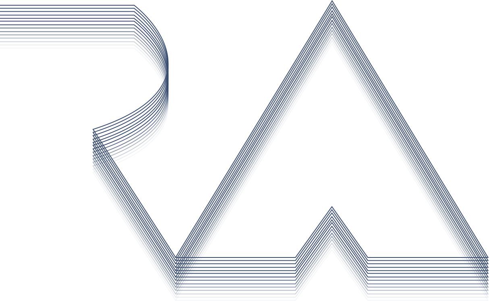

    <picture>
        <source media="(prefers-color-scheme: dark)" srcset="./readme/assets/images/main-logo-dark.svg" />
        <source media="(prefers-color-scheme: light)" srcset="./readme/assets/images/main-logo-light.svg" />
        
    </picture>

    <picture>
        <source media="(prefers-color-scheme: dark)" srcset="https://readme-typing-svg.herokuapp.com?font=Montserrat&weight=500&size=35&pause=1500&color=F0F0F1&center=true&vCenter=true&width=700&height=35&lines=Hey!+I+am+Rendel+Abainza+(%E3%81%A5+%E2%97%95%E2%80%BF%E2%97%95+)%E3%81%A5;Nice+to+meet+you!" />
        <source media="(prefers-color-scheme: light)" srcset="https://readme-typing-svg.herokuapp.com?font=Montserrat&weight=500&size=35&pause=1500&color=0B0B0B&center=true&vCenter=true&width=700&height=35&lines=Hey!+I+am+Rendel+Abainza+(%E3%81%A5+%E2%97%95%E2%80%BF%E2%97%95+)%E3%81%A5;Nice+to+meet+you!" />
        
    </picture>

##

     I like building things that feel calm, consistent, and easy to use—whether it's an interface or a small internal tool.

    <a href="https://rabnza-portfolio.vercel.app" target="_blank" rel="noopener noreferrer"><strong>(✦‿✦) Click to see my live portfolio →</strong></a> 
    <a href="https://github.com/RAbnza/rabnza-portfolio" target="_blank" rel="noopener noreferrer">View the source on GitHub</a>

## Core Tech Stack

    
    
    
    
    
    
    
    

    
    
    
    
    
    

    

## Selected Projects

    
<strong>RAbnza Portfolio</strong> — polished personal site built with React, Vite, TailwindCSS, Framer Motion, and Lenis.

    <ul>
        <li>Built a calm-first layout with responsive typography, motion preferences, and smooth scroll orchestration.</li>
        <li>Structured data-driven project and hobbies sections for effortless updates.</li>
        <li>Optimized load times with Vite code-splitting and asset pruning.</li>
    </ul>
    

        <a href="https://rabnza-portfolio.vercel.app" target="_blank" rel="noopener noreferrer">Live demo</a>
        ·
        <a href="https://github.com/RAbnza/rabnza-portfolio" target="_blank" rel="noopener noreferrer">Source</a>
    

    
<strong>HomeRoom</strong> — rental management platform (Laravel, PHP, Tailwind CSS, MySQL).

    <ul>
        <li>Led a 5-person team to streamline landlord and tenant workflows.</li>
        <li>Implemented automated dues tracking, reminders, and tenant summaries.</li>
    </ul>
    

        <a href="https://github.com/COMP-016-Web-Development-Group-1/HomeRoom" target="_blank" rel="noopener noreferrer">Source</a>
    

    
<strong>TravelWise</strong> — itinerary planner (Java, Swing / JFrame).

    <ul>
        <li>Implemented Branch and Bound knapsack + Boyer–Moore algorithms to optimize trip plans.</li>
        <li>Delivered a guided UI for destination, activity, and budget selection.</li>
    </ul>
    

        <a href="https://github.com/RAbnza/TravelWise" target="_blank" rel="noopener noreferrer">Source</a>
    

    
<strong>RentEase</strong> — property management assistant (Java, JavaFX, MySQL).

    <ul>
        <li>Automated rent and utility calculations, vacancy tracking, and digital receipts for landlords.</li>
        <li>Integrated secure database access with real-time notification hooks.</li>
    </ul>
    

        <a href="https://github.com/LesterOsana18/RentEase-Application" target="_blank" rel="noopener noreferrer">Source</a>
    

## Experience & Education

### Experience

- <strong>Full-Stack Developer Intern — RADMedics Corporation</strong> 
<small>Aug 2025 – Sep 2025 · Mandaluyong, Philippines</small>
<ul>
    <li>Delivered the official EMS-focused website with Laravel + Tailwind architecture and responsive design.</li>
    <li>Optimized asset delivery, page speed, and cross-device accessibility benchmarks.</li>
    <li>Collaborated on information architecture to keep education and community-focused content discoverable.</li>
</ul>

### Education

- <strong>Bachelor of Science in Computer Science</strong>, Polytechnic University of the Philippines 
  <small>2021 – Present · Sta. Mesa, Manila · President's List (multiple terms)</small>
- <strong>Information and Communications Technology Strand</strong>, Polytechnic University of the Philippines 
  <small>2019 – 2021 · Sta. Mesa, Manila · Graduated with High Honors (Top 5%)</small>

## Connect with me

    
    
    
    

